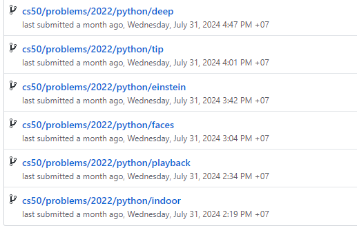
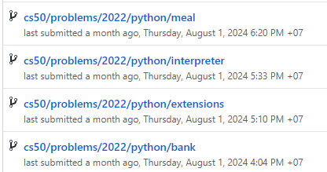
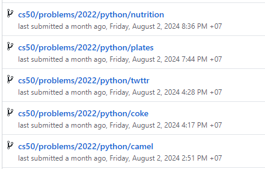
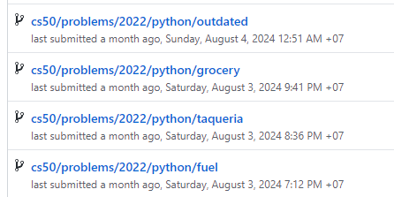
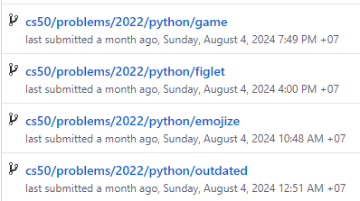

# Introduction

Đây là bài tập cho môn học Computation Physics, câu số 3

## Đề bài:

Viết code cho các bài tập nhỏ sau [tập học chút tiếng Anh]: [Nhớ ‘report’ vào bảng ở trên và gửi code
cho tôi qua email] - Write a code that converts temperature in 𝐹 [Farenheit] to 𝐶 [Celsius], and vice versa.

- Convert the string "123.4" into a float, add 56 to it, and then convert it back into a string.

- Format the float 27847.91284582, its square, and its cube, using scientific notation with 2, 3, and
  4 decimal places respectively.

- Use string formatting and sign control to create a table of three columns of numbers. The first
  column should include 10 numbers starting from −10 in steps of 2.2, the second column should
  include all odd numbers between 50 and 70, and the third column should include all powers of 4
  of the integers 0−9. Use any delimiter you wish to visually separate the three columns.”
  Tức là các bạn tạo bảng 3 cột kiểu tựa tựa như sau (ở đây, đã dùng delimiter là dấu “ | ” )

```Python
    xxx1 | xyz1 | zzz1
    xxx2 | xyz2 | zzz2
    xxx3 | xyz3 | zzz3
    …
```

- Use if statement:
  Find the smallest of three real numbers a, b, and c.

- Use while loop:
  Print out all square numbers less than 70.

- Use for loop and range:
  Calculate the squares of all numbers between 7 and 14.

- Complete the following code to print all square numbers between 10 and 80.

  ```python
  #!/usr/bin/env python
  i = 0

  while True:
  ```

- Create a list containing the squares of all integers from 0 to 100 that are divisible by 3 and 7.
- Write a Python program that reads in a one-column list of numbers, and calculates the sum.
- Write a Python program that calculates the 6 times table, and outputs it to a file 6times.da

| Ngày       | Nội dung học                                                                                                                  | Các việc/code cụ thể đã học, làm được                                                                                                                                                                                                                                                                   |
| ---------- | ----------------------------------------------------------------------------------------------------------------------------- | ------------------------------------------------------------------------------------------------------------------------------------------------------------------------------------------------------------------------------------------------------------------------------------------------------- |
| 31/7       | Week 0: Functions, Variables                                                                                                  | \* Install Python and packages <br/> \* Test và bảo đảm python chạy tốt <br/> \* Kiếm được trang web dạy [edX](https://learning.edx.org/course/course-v1:HarvardX+CS50P+Python/home) và [cs50](https://cs50.harvard.edu/python/2022/) <br/>  <br/> \* Hoàn thành bài tập của tuần 0 |
| 1/8        | Week 1: Conditionals                                                                                                          | \* Học xong tuần 1 <br/> \*Hoàn thành bài tập tuần 1 của cs50                                                                                                                                                                                                                     |
| 2/8        | Week 2: Loops                                                                                                                 | \* Học xong tuần 2<br/> \*Hoàn thành bài tập tuần 2 của cs50                                                                                                                                                                                                                      |
| 3/8 và 4/8 | Week 3: Exceptions                                                                                                            | \* Học xong tuần 3<br/> \*Hoàn thành bài tập tuần 3 của cs50                                                                                                                                                                                                                      |
| 4/8 và 5/8 | Week 4: Libraries                                                                                                             | \* Học xong tuần 4<br/> \*Hoàn thành bài tập tuần 4 của cs50                                                                                                                                                                                                                      |
|            | Week 5: Unit Tests                                                                                                            |
|            | Week 6: File I/O                                                                                                              |
|            | Week 7: Regular Expressions                                                                                                   |
|            | Week 8: Object-Oriented Programming                                                                                           |
|            | Week 9: Et Cetera                                                                                                             |
| Đến 13/8   | Làm đồ án môn học và hoàn thành các bài tuần trước                                                                            |  <br/> CS50 yêu cầu phải đăng video dài 3p về đồ án và đây là link tới youtube https://youtu.be/PGsBpj9mK2Q?si=d_HS0leMx_l8HCjo                                                                                                                                                    |
| 17-25/8    | Thử code một chương trình tính toán ma trận, tính được + - \* và định thức của ma trận, chưa tính được nghịch đảo của ma trận | Link tới github https://github.com/nguyn21012003/matrix-calculator và youtube demo https://youtu.be/KV-I0GRBzl0                                                                                                                                                                                         |
| 24/8       | Làm bài tuần 1 của môn học PPTT cho VLLT                                                                                      | Đã gửi qua mail                                                                                                                                                                                                                                                                                         |
