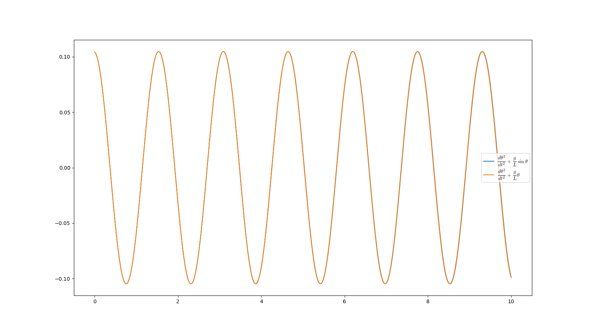
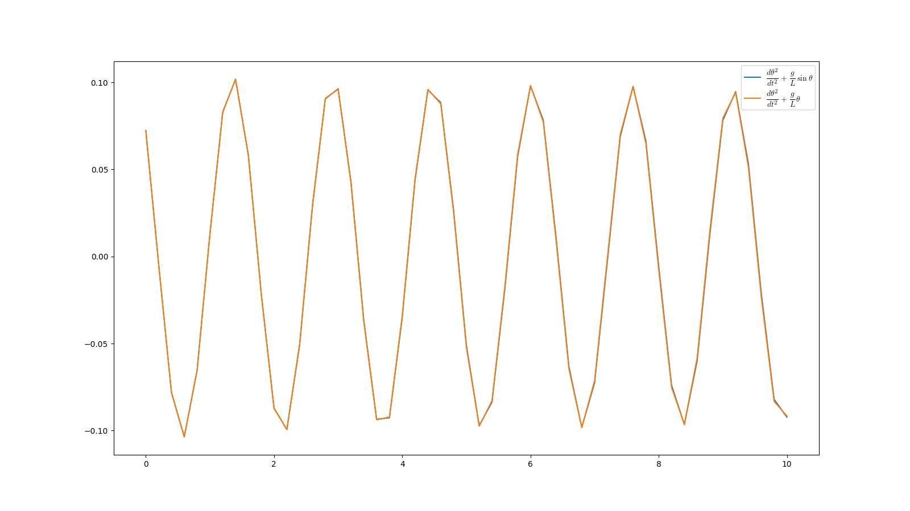

# Giải hệ phương trình ODE
## Bài toán định luật Kirchhoff cho mạch điện

### Source code

```python
import numpy as np
import matplotlib.pyplot as plt
from numpy import exp
import numpy.typing as npt

def fArr(tn: float, yn: float) -> npt.NDArray:
    F = np.zeros(2)
    F[0] = -4 * yn[0] + 3 * yn[1] + 6
    F[1] = -2.4 * yn[0] + 1.6 * yn[1] + 3.6

    return F

def mem(fArr: npt.NDArray, tn: npt.NDArray, yn: npt.NDArray, h: float) -> npt.NDArray:
    return yn + h * (fArr(tn, yn) + fArr(tn, yn + h * fArr(tn, yn))) / 2


def rk4(fArr: npt.NDArray, tn: npt.NDArray, yn: npt.NDArray, h: float) -> npt.NDArray:
    k1 = fArr(tn, yn)
    k2 = fArr(tn + 0.5 * h, yn + 0.5 * h * k1)
    k3 = fArr(tn + 0.5 * h, yn + 0.5 * h * k2)
    k4 = fArr(tn + h, yn + h * k3)

    return yn + h / 6 * (k1 + 2 * k2 + 2 * k3 + k4)

  
def solve_sys_ode(fArr: npt.NDArray, a: float, b: float, h: float, solver: npt.NDArray, N: int) -> npt.NDArray:
    yn = np.zeros(2)
    y = []
    tspan = np.arange(a, b + h, h)
    for j in range(N):
        yn = solver(fArr, tspan, yn, h)
        y.append(yn)

    return y

  
def fExactArr(x: npt.NDArray) -> npt.NDArray:
    F = np.zeros(2)
    F[0] = -3.375 * exp(-2 * x) + 1.875 * exp(-0.4 * x) + 1.5
    F[1] = -2.25 * exp(-2 * x) + 2.25 * exp(-0.4 * x)

    return F

def ploty(file: str, x: npt.NDArray, y: list, N: int):
    fig, axs = plt.subplots(figsize=(15, 7))
    
    yrk4 = y["rk4"]
    ymem = y["ymem"]
    yExact1 = y["yExact1"]
    yExact2 = y["yExact2"]
    y1_RK4 = []
    y2_RK4 = []
    for i in range(len(yrk4)):
        y1_RK4.append(yrk4[i][0])
        y2_RK4.append(yrk4[i][1])

    y1_MEM = []
    y2_MEM = []
    for i in range(len(ymem)):
        y1_MEM.append(ymem[i][0])
        y2_MEM.append(ymem[i][1])


    axs.plot(x, yExact1, "r", lw=2, ls=":", marker="D", markevery=10, label="Nghiệm giải tích")
    axs.plot(x, yExact2, "r", lw=2, ls=":", marker="D", markevery=10)
    axs.plot(x, y1_RK4, "g", lw=2, ls=":", marker="v", markevery=11, label="Nghiệm RK4")
    axs.plot(x, y2_RK4, "g", lw=2, ls=":", marker="v", markevery=11)
    axs.plot(x, y1_MEM, "b", lw=2, ls=":", marker="o", markevery=12, label="Nghiệm MEM")
    axs.plot(x, y2_MEM, "b", lw=2, ls=":", marker="o", markevery=12)

    plt.grid()
    axs.legend()
    plt.savefig(file)

    plt.show()

def main():
    a, b = 0, 1
    N = 1000
    h = (b - a) / N
    file = "data.png"
    x = np.linspace(0, 1, N)
    y = {}
    y["rk4"] = solve_sys_ode(fArr, a, b, h, rk4, N)
    y["ymem"] = solve_sys_ode(fArr, a, b, h, mem, N)
    list_yExact1 = []
    list_yExact2 = []
    y["yExact1"] = list_yExact1
    y["yExact2"] = list_yExact2
    for i in range(len(x)):
        yExact1, yExact2 = fExactArr(x[i])
        list_yExact1.append(yExact1)
        list_yExact2.append(yExact2)
    ploty(file, x, y, N)

if __name__ == "__main__":
    main()
```

### Kết quả


## Bài toán con lắc đơn

### Source code

```python
import numpy as np
import numpy.typing as npt
from numpy import sin, cos, pi
import matplotlib.pyplot as plt
import csv
  

def fArr1(t: float, y0: float):
    theta, omgega = y0
    g = 9.81
    L = 0.6
    F = np.zeros(2)
    F[0] = omgega
    F[1] = -(g / L) * sin(theta)
  
    return F


def fArr2(t: float, y0: float):
    theta, omgega = y0
    g = 9.81
    L = 0.6
    F = np.zeros(2)
    F[0] = omgega
    F[1] = -(g / L) * (theta)

    return F


def rk4(fArr: npt.NDArray, tn: npt.NDArray, yn: npt.NDArray, h: float) -> npt.NDArray:
    k1 = fArr(tn, yn)
    k2 = fArr(tn + 0.5 * h, yn + 0.5 * h * k1)
    k3 = fArr(tn + 0.5 * h, yn + 0.5 * h * k2)
    k4 = fArr(tn + h, yn + h * k3)

    return yn + h / 6 * (k1 + 2 * k2 + 2 * k3 + k4)

  
def solve_sys_ode(fArr1, fArr2: npt.NDArray, a: float, b: float, h: float, solver: npt.NDArray, N: int) -> npt.NDArray:
    big = []
    small = []
    yn = np.zeros(2)
    yn1 = np.zeros(2)
    yn[0] = pi / 30
    yn1[0] = pi / 30
    yn[1] = 0
    yn1[1] = 0
    t = np.arange(a, b + h, h)

    for j in range(N + 1):
        yn = solver(fArr1, t, yn, h)
        big.append(yn)

    for i in range(N + 1):
        yn1 = solver(fArr2, t, yn1, h)
        small.append(yn1)

    return big, small


def plotTheta(t, big_theta, small_theta):
    fig, axs = plt.subplots(figsize=(15, 7))

    plt.rcParams["text.usetex"] = True

    axs.plot(t, big_theta, t, small_theta)

    axs.legend([r"$\displaystyle\frac{d\theta^2}{dt^2} + \frac{g}{L} \sin\theta$", r"$\displaystyle\frac{d\theta^2}{dt^2} + \frac{g}{L}\theta$"])

    plt.savefig("pendulumTheta.png")

    plt.show()
  

def saveLog(file, t, big_theta, small_theta):
    with open(file, "w", newline="", encoding="utf8") as writefile:
        header = [
            f"{'t':^4}",
            f"{'sin θ':^25}",
            f"{'θ':^25}",
            f"{'sin θ - θ':^25}",
        ]
        writer = csv.DictWriter(writefile, fieldnames=header, delimiter="|")
        writer.writeheader()
        for i in range(len(t)):
            writer.writerow(
                {
                    f"{'t':^4}": f"{i:^4}",
                    f"{'sin θ':^25}": f"{float(big_theta[i]):^25}",
                    f"{'θ':^25}": f"{float(small_theta[i]):^25}",
                    f"{'sin θ - θ':^25}": f"{float(big_theta[i] - small_theta[i]):^25}",
                }
            )

  
def main():
    N = 1000
    t0 = 0
    tn = 10
    file = "data.txt"

    h = (tn - t0) / N
    t = np.arange(t0, tn + h, h)

    big, small = solve_sys_ode(fArr1, fArr2, t0, tn, h, rk4, N)
    big_theta = []
    small_theta = []

    for i in range(len(big)):
        big_theta.append(big[i][0])
        small_theta.append(small[i][0])

    saveLog(file, t, big_theta, small_theta)
  
if __name__ == "__main__":

    main()
```

### Kết quả



N vòng lặp nhỏ thì sẽ thấy sai số


