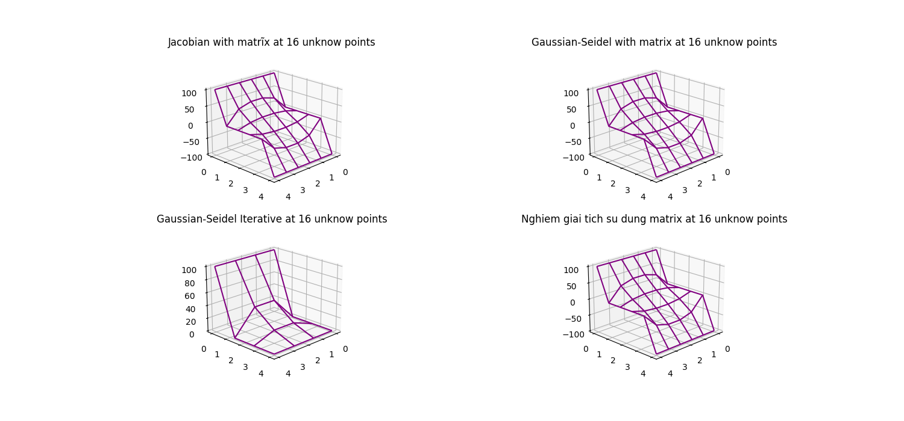

## Electrostatic Potentials

### Lý thuyết

Thế năng điện từ $U(\mathbf{x})$ có thể được dẫn ra bằng mật độ điện tích $\rho(\mathbf{x})$ sao cho thỏa phương trình $\textit{Poisson}$

$$
\begin{align}
	\nabla^2 U(\mathbf{x}) = - \frac{1}{\epsilon_0} \rho(\mathbf{x}),
\end{align}\tag{1}
$$

trong đó $\rho(\mathbf{x})$ là mật độ điện tích. Trong vùng không có điện tích, $\rho(\mathbf{x})=0$, và thế năng ở phương trình (1) thỏa phương trình $Laplace$:

$$
\begin{align}
	\nabla^2 U(\mathbf{x}) = 0.
\end{align}\tag{2}
$$

Giả sử bài toán đang xét cho trường hợp 2-D, ta chia nhỏ không gian thành dạng của ô mạng tinh thể, và giải $U(\mathbf{x})$ cho từng điểm mạng.

### Thuật toán

  

#### Lý thuyết

Ta khai triển Taylor cho phương trình (2)

$$
\begin{gather}
	u(x - \Delta x,y) = u(x,y) - \frac{\partial u}{\partial x} + \frac{1}{2} \frac{\partial^{2} u}{\partial x^{2}} (\Delta x)^{2} - ...
\end{gather}\tag{3}
$$

$$
\begin{gather}
    u(x + \Delta x,y) = u(x,y) + \frac{\partial u}{\partial x} + \frac{1}{2} \frac{\partial^{2} u}{\partial x^{2}} (\Delta x)^{2} + ...
\end{gather}\tag{4}
$$

(3) + (4)

$$
\begin{gather}
    \Rightarrow \frac{\partial^{2} u}{\partial x^{2}} \approx \frac{u(x - \Delta x,y) + u(x + \Delta x,y) + 2u(x,y)}{(\Delta x)^{2}}
\end{gather} \tag{5}
$$

Một cách tương tự ta có cho

$$
\begin{gather}
    \Rightarrow \frac{\partial^{2} u}{\partial y^{2}} \approx \frac{u(x,y-\Delta y) + u(x ,y + \Delta y) + 2u(x,y)}{(\Delta y)^{2}}
\end{gather}\tag{6}
$$

$$
\frac{u(x - \Delta x,y) + u(x + \Delta x,y) + 2u(x,y)}{(\Delta x)^{2}} + \frac{u(x,y-\Delta y) + u(x ,y + \Delta y) + 2u(x,y)}{(\Delta y)^{2}} = 0
$$

Đặt $\Delta x \equiv h, \Delta y \equiv k$, cộng (5) và (6), ta có

$$
\begin{gather}
	2 \left[ \frac{h^{2}}{k^{2}} + 1 \right]u(x,y) - \left[ u(x+h,y) + u(x-h,y) \right] - \frac{h^{2}}{k^{2}}\left[ u(x,y+k) + u(x,y-k) \right] \\
	- \frac{h^{2}}{k^{2}} \left[ u(x,y + k) + u(x,y - k)  \right] = 0
\end{gather}\tag{7}
$$

### Finite Difference

$$
\begin{gather}
	x \rightarrow x_{0} + i h  \\
	y \rightarrow y_{0} + i k
\end{gather}\tag{9}
$$

và

$$
\begin{gather}
u_{ij} \equiv u(x_{i},y_{j}); \quad i = 1,...n - 1, ; \quad j = 1,..., - 1
\end{gather} \tag{10}
$$

Ta có:

$$
\begin{gather}
2\left[ \frac{h^{2}}{k^{2}} + 1 \right] u_{ij} - \left[ u_{i + 1, j} + u_{i - 1, j} \right] - \frac{h^{2}}{k^{2}} \left[ u_{i, j+1} + u_{i,j - 1} \right]
\end{gather} \tag{11}
$$

đặt $h=k$, từ đó ta có viết lại (11)

$$
\begin{align}
    u_{ij} = \frac{1}{4} (u_{i+1,j}+u_{i-1,j}+u_{i,j+1}+u_{i,j-1})
\end{align}\tag{12}
$$

#### Phương pháp ma trận

Ta xem ''mạng'' trên như là ma trận, với các điểm màu đỏ là điểm cần giải, mỗi điểm cách nhau một $h = 1/4$. Tại $y_{max}$ tất cả giá trị bằng điều kiện đầu, như vậy với $n$ điểm màu đỏ, thì ứng với $n$ điểm màu xanh là điều kiện đầu, và có tổng cộng $n+2$ điểm màu xanh.

Giả sử, ta xét ma trận $V$ là ma trận có chỉ số $i,j$. Để tính được toàn bộ số điểm màu đỏ cần giải, ta cần phải chuyển đổi chỉ số từ ma trận $V$ sang một ma trận một chiều $U$ có chứa các thành phần ma trận tương ứng. Với một ma trận vuông $V_{N\times N}$ , ta có

$$
V_{i,j} = U_{i\times N + j}
$$

| \($v_{i,j}$\) |       | \($u_{k}$\)              |
| ------------- | ----- | ------------------------ |
| \(i\)         | \(j\) | \(k = i $\times$ N + j\) |
| 0             | 0     | 0                        |
| 0             | 1     | 1                        |
| 0             | 2     | 2                        |
| 1             | 0     | 3                        |
| 1             | 1     | 4                        |
| 1             | 2     | 5                        |
| 2             | 0     | 6                        |
| 2             | 1     | 7                        |
| 2             | 2     | 8                        |

Như vậy ta hoàn toàn có thể biểu diễn ma trận $V$ dưới dạng ma trận $U$.

#### Dẫn ra ma trận

Từ phương trình

$$
A u = B,
$$

xét 25 điểm mạng tương ứng với đó là 9 điểm $u$ (điểm màu đỏ). Ta có hệ phương trình sau

$$
\begin{align}
&100  - 4 u_0 + u_1 + \quad + u_3 + \quad + \quad = 0\\
&\quad  100 + u_0 - 4u_1 + u_2 + \quad + u_4 + \quad = 0\\
&\quad  \quad  100 + u_1 - 4u_2 + \quad + \quad + u_5 = 0
\end{align}\tag{13}
$$

$$
\begin{align}
&u_0 \quad \quad - 4u_3 + u_4 + \quad + u_6 = 0 \\
&\quad u_1 \quad \quad + u_3 - 4u_4 + u_5 + \quad u_7 = 0 \\
&\quad \quad u_2 \quad \quad + u_4 - 4u_5 \quad \quad u_8 = 0
\end{align}\tag{14}
$$

$$
\begin{align}
&u_3 \quad \quad - 4u_6 + u_7 \quad = 0 \\
& \quad u_4 \quad + u_6 - 4u_7 + u_8 = 0 \\
& \quad \quad u_5  \quad + u_7 - 4u_8 = 0
\end{align}\tag{15}
$$

Như vậy $A$ sẽ có dạng đường chéo

  

Hình trên là với $11$ điểm chưa biết.

Ta có thể giải ma trận trên bằng phương trình hàm riêng trị riêng, với trị riêng $U$. Ta phải chuyển đổi chỉ số từ $U\rightarrow V$.

> Để chéo hoá ma trận $A$, ta có thể sử dụng một số phương pháp để chéo hoá như là phương trình hàm riêng trị riêng , v.v. Một trong số đó là cách giải số theo phương pháp Jacobian và Gaussian-Seidel. Đồng thời phải đảm bảo tính ma trận chéo trội

$$
\begin{align}
<<<<<<< HEAD
\lvert a\_{ij} \rvert > \sum^{N}{i \neq j;j = 1} \lvert a{ij} \rvert
=======
 \lvert a_{ij} \rvert > \sum^{N}_{i \neq j;j = 1} \lvert a_{ij} \rvert
>>>>>>> ae072c3837e0092e1a12f797dd15aed774ab7c18
\end{align}\tag{16}
$$

#### Jacobian Iterative Method

Phương pháp Jacobian cho ta kết quả là nghiệm duy nhất của cả hệ phương trình (13), (14), (15). Bằng cách cô lập biến $u_{1}$ cho phương trình thứ nhất và $u_{2}$ cho phương trình thứ 2 và cứ thế tiếp tục ta có được nghiệm là

$$
\begin{gather}
u_{1} = \frac{1}{a_{11}} (b_{1} - a_{12}u_{2} - a_{13}u_{3} - ... a_{1n}u_{n})\\
u_{2} = \frac{1}{a_{22}} (b_{2} - a_{21}u_{1} - a_{23}u_{3} - ... a_{2n}u_{n})\\
u_{n} = \frac{1}{a_{nn}} (b_{n} - a_{n1}u_{1} - a_{n2}u_{2} - ... a_{n,n-1}u_{n-1})\\
\end{gather}
$$

ta viết lại thành

$$
\begin{gather}
u_{i} = \frac{1}{a_{ii}} \left[ \sum_{j=1,i\neq j}^{N} - a_{ij} u_{j} + b_{i} \right]
\end{gather} \tag{17}
$$

### Kết quả

  

  

### Source code

[Sourcode on Github](https://github.com/nguyn21012003/homework-for-pptt/tree/main/buoi_7_3110)
