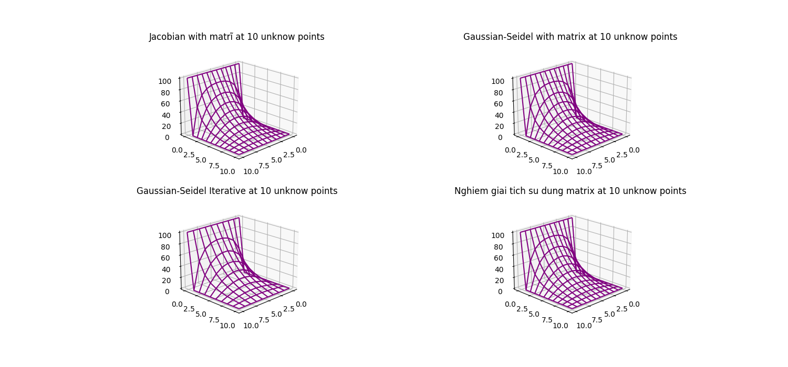

## Electrostatic Potentials

### Lý thuyết

Thế năng điện từ $U(\mathbf{x})$ có thể được dẫn ra bằng mật độ điện tích $\rho(\mathbf{x})$ sao cho thỏa phương trình $\textit{Poisson}$

$$
\begin{align}
\nabla^2 U(\mathbf{x}) = - \frac{1}{\epsilon_0} \rho(\mathbf{x}),
\end{align}\tag{1}
$$

trong đó $\rho(\mathbf{x})$ là mật độ điện tích. Trong vùng không có điện tích, $\rho(\mathbf{x})=0$, và thế năng ở phương trình (1) thỏa phương trình $Laplace$:

$$
\begin{align}
\nabla^2 U(\mathbf{x}) = 0.
\end{align}\tag{2}
$$

Giả sử bài toán đang xét cho trường hợp 2-D, ta chia nhỏ không gian thành dạng của ô mạng tinh thể, và giải $U(\mathbf{x})$ cho từng điểm mạng.

### Thuật toán

#### Phương pháp ma trận

Ta xem ''mạng'' trên như là ma trận, với các điểm màu đỏ là điểm cần giải, mỗi điểm cách nhau một $h = 1/4$. Tại $y_{max}$ tất cả giá trị bằng điều kiện đầu, như vậy với $n$ điểm màu đỏ, thì ứng với $n$ điểm màu xanh là điều kiện đầu, và có tổng cộng $n+2$ điểm màu xanh.

Giả sử, ta xét ma trận $V$ là ma trận có chỉ số $i,j$. Để tính được toàn bộ số điểm màu đỏ cần giải, ta cần phải chuyển đổi chỉ số từ ma trận $V$ sang một ma trận một chiều $U$ có chứa các thành phần ma trận tương ứng. Với một ma trận vuông $V_{N\times N}$ , ta có

$$
V_{i,j} = U_{i\times N + j}
$$

| \(v\) |       | \(u\)                    |
| ----- | ----- | ------------------------ |
| \(i\) | \(j\) | \(k = i $\times$ N + j\) |
| 0     | 0     | 0                        |
| 0     | 1     | 1                        |
| 0     | 2     | 2                        |
| 1     | 0     | 3                        |
| 1     | 1     | 4                        |
| 1     | 2     | 5                        |
| 2     | 0     | 6                        |
| 2     | 1     | 7                        |
| 2     | 2     | 8                        |

Như vậy ta hoàn toàn có thể biểu diễn ma trận $V$ dưới dạng ma trận $U$.

### Dẫn ra ma trận

Từ phương trình

$$
A u = B,
$$

xét 25 điểm mạng tương ứng với đó là 9 điểm $u$ (điểm màu đỏ). Ta có hệ phương trình sau

$$
\begin{align}
&100  - 4 u_0 + u_1 + \quad + u_3 + \quad + \quad = 0\\
&\quad  100 + u_0 - 4u_1 + u_2 + \quad + u_4 + \quad = 0\\
&\quad  \quad  100 + u_1 - 4u_2 + \quad + \quad + u_5 = 0
\end{align}\tag{1}
$$

$$
\begin{align}
&u_0 \quad \quad - 4u_3 + u_4 + \quad + u_6 = 0 \\
&\quad u_1 \quad \quad + u_3 - 4u_4 + u_5 + \quad u_7 = 0 \\
&\quad \quad u_2 \quad \quad + u_4 - 4u_5 \quad \quad u_8 = 0
\end{align}\tag{2}
$$

$$
\begin{align}
&u_3 \quad \quad - 4u_6 + u_7 \quad = 0 \\
& \quad u_4 \quad + u_6 - 4u_7 + u_8 = 0 \\
& \quad \quad u_5  \quad + u_7 - 4u_8 = 0
\end{align}\tag{3}
$$

Như vậy $A$ sẽ có dạng đường chéo

Hình trên là với $11$ điểm chưa biết.

Ta có thể giải ma trận trên bằng phương trình hàm riêng trị riêng, với trị riêng $U$. Ta phải chuyển đổi chỉ số từ $U\rightarrow V$.

### Kết quả

