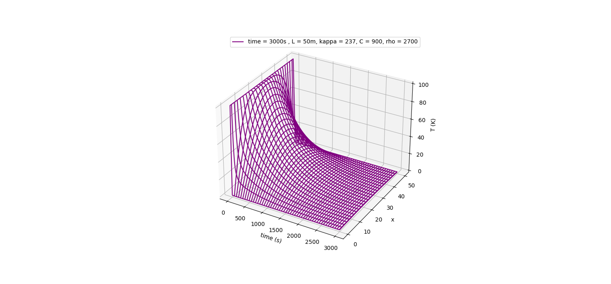

# Heat Equation

## Method

### Forward Difference

### Kết quả



### Sour code

```python
import numpy as np
import subprocess
import csv
import matplotlib.pyplot as plt

np.set_printoptions(precision=10, linewidth=1200, edgeitems=24)

def FowardDiff(x: int, t: int, eta: float) -> list:
    """Create the main of this code. Its about to solve the PE for Heat equation problem.
    By using j is the step of time, when we discreted time and L.
    Args:
        x: (int) take the max length of the rod
        t: (int) take the max time to heat the rod
        eta: (float) the constant represent for the thermal conductivity of materials, and the specific heat, and density
        
    x,t must be interger in order to we will call this as matrix index in later.

    Returns:
        U: (list) this array will be stored all the value of the "lattice like" index, which I will the matrix in later. 
    """
    U = []
    for _ in range(x + 1):
        row = []
        for _ in range(t + 1):
            row.append(0.0)
        U.append(row)

    for xi in range(1, x):
        U[xi][0] = 100.0

    for ti in range(1, t + 1):
        U[0][ti] = 0.0
        U[x][ti] = 0.0

    for j in range(t):
        for i in range(1, x):
            U[i][j + 1] = (1 - 2 * eta) * U[i][j] + eta * (U[i + 1][j] + U[i - 1][j])  

    return U

  
  

def writeLog(x: int, t: int, dx: int, dt: int, U: list) -> None:
    file = "heatEquationData.txt"
    with open(file, "w", newline="") as writefile:
        header = [
            f"{'x':^4}",
            f"{'t':^8}",
            f"{'U':^10}",
        ]
        writer = csv.DictWriter(writefile, fieldnames=header, delimiter="\t")
        writer.writeheader()
        prev_xi = None
        for xi in range(x + 1):
            if prev_xi is not None and xi != prev_xi:
                writer.writerow({})
                
            for ti in range(t + 1):
                writer.writerow(
                    {
                        f"{'x':^4}": f"{xi:^4}",
                        f"{'t':^8}": f"{ti:^8}",
                        f"{'U':^10}": f"{U[xi][ti]:^10}",
                    }
                )
            prev_xi = xi
    U = np.array(U)
    X = np.linspace(0, int(x), x + 1)
    T = np.linspace(0, int(t), t + 1)
    fig = plt.figure(figsize=(15, 7))
    X, T = np.meshgrid(T, X)
    ax1 = fig.add_subplot(projection="3d")
    ax1.plot_wireframe(X, T, U, color="purple")
    ax1.set_xlabel("time (s)")
    ax1.set_zlabel("T (K)")
    ax1.set_ylabel("x")
	ax1.legend([f"time = {t}s , L = {L}m, kappa = {kappa}, C = {Cv}, rho = {rho}"])
    plt.show()

    return None+

def gnuPlot(file: str) -> None:
    """
    Không xài dòng nào thì # vào dòng đó
    """
    with open("gnuPlot.gp", "w") as gnuplot:
        gnuplot.write(
            f"""
    #set multiplot layout 1,3
  
    set ylabel "y"
    set xlabel "x"
    set zlabel "z"
  
    set grid
    #set key horiz

    splot "{file}" u 1:2:3 with lines
    set datafile separator '\t'

    pause -1
"""
        )
    subprocess.run(["gnuplot", "gnuPlot.gp"])

    return None


def main():
    L = 50  ### Mét
    t = 1000

    kappa = 210  #### Thông số lấy trong Rubin
    Cv = 900
    rho = 2700
    dL = 0.005
    dt = 0.1
    eta = kappa / (Cv * rho) * dt / (dL**2)
    U = FowardDiff(L, t, eta)
    writeLog(L, t, dL, dt, U)
    gnuPlot(file="heatEquationData.txt")

if __name__ == "__main__":
    main()
```

